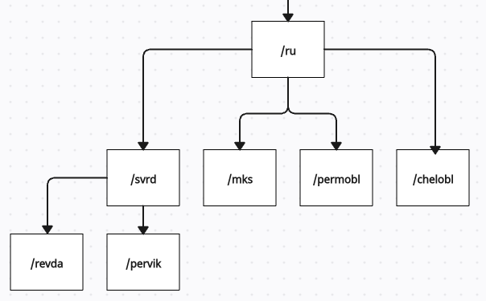

## Реализация сервиса подбора рекламных площадок для конкретного региона.

В сервисе реализованы **2** метода **REST API**:
1. Метод загрузки рекламных площадок из файла (полностью
перезаписывает всю хранимую информацию).
2. Метод поиска списка рекламных площадок для заданной локации.

### Особенности реализации

- Данные хранятся в оперативной памяти в виде дерева, где каждый узел представляет определенную локацию и рекламные площадки для конкретного региона.

- Кэш реализован в виде словаря с парами:

    - **ключ**: локация

    - **значение**: список площадок

### Запуск с докером

Запустить **Docker Compose** в папке с проектом:

    docker compose up -d --build

API доступно по адресу:

    http://localhost:8080/api

Документация:

    http://localhost:8080/api/swagger

Выключение запущенного контейнера:

    docker compose down

### Запуск вручную

Запустить команды в папке с проектом:

    dotnet publish AdPlatforms/AdPlatforms.csproj -c Release -o ./app/publish &&
    dotnet app/publish/AdPlatforms.dll

API доступно по адресу:

    http://localhost:5000/api

Документация:

    http://localhost:5000/api/swagger

### Запуск тестов

Запустить команду в папке с проектом:

    dotnet test

